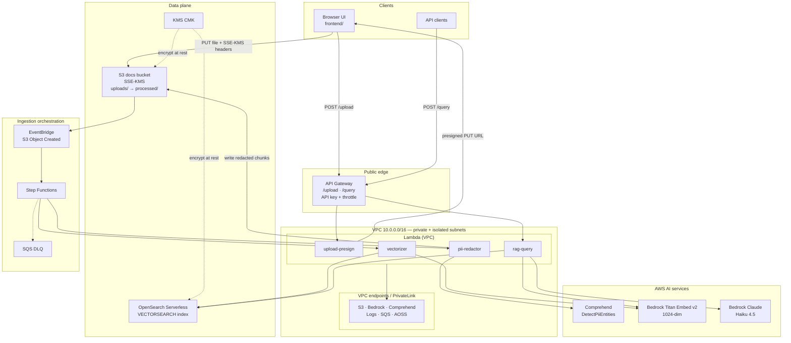
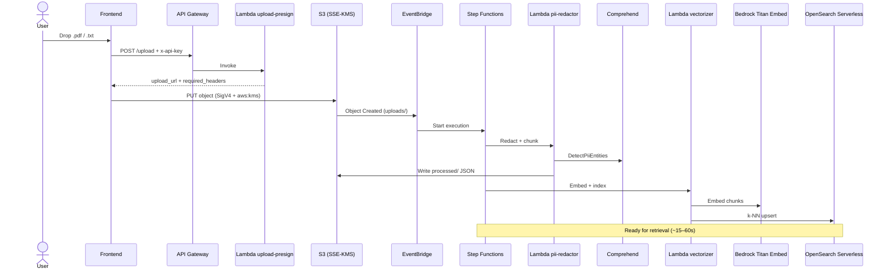
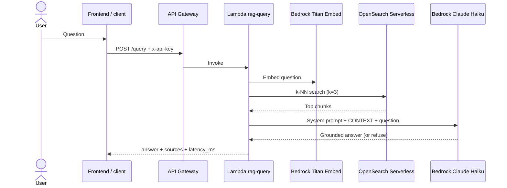
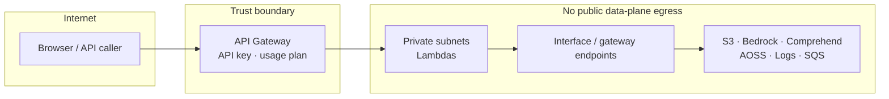

# Architecture — Enterprise Secure RAG (AWS Option A)

- Date: 2026-08-06
- Scope: Phases 1–4 as implemented in this repo
- Region: `us-east-1`

## High-level architecture

## Document intake path

## Query / RAG path

## Network & security controls

| Control | Implementation |
|---|---|
| Encryption at rest | S3 SSE-KMS, CMK from Phase 1 |
| Upload auth | API key on `POST /upload`; short-lived SigV4 presign |
| Query auth | API key + throttle/quota on API Gateway |
| PII | Comprehend redaction before embed/index |
| Network | PrivateLink/VPC endpoints; no IGW/NAT for Lambdas |
| Isolation | OpenSearch Serverless collection policies; least-privilege IAM |

## Terraform phase map

| Phase | Directory | What it builds |
|---|---|---|
| 1 | `terraform/phase1_network` | VPC, subnets, KMS, S3 docs bucket, core VPC endpoints |
| 2 | `terraform/phase2_ingestion` | PII Lambda, Step Functions, EventBridge, DLQ, more endpoints |
| 3 | `terraform/phase3_vector` | OpenSearch Serverless, vectorizer Lambda, Titan embed wiring |
| 4 | `terraform/phase4_rag_api` | RAG query Lambda, API Gateway `/query` + `/upload`, S3 CORS |

## Runtime components (by name pattern)

- `enterprise-rag-upload-presign`
- `enterprise-rag-pii-redactor`
- `enterprise-rag-vectorizer`
- `enterprise-rag-rag-query`
- Collection: `enterprise-rag-vectors` · Index: `rag-chunks`
- Models: Titan Embed Text v2 (`1024` dims), Claude Haiku 4.5 inference profile

## Viewing this diagram

- **GitHub:** open `docs/architecture.md` — Mermaid renders natively
- **VS Code / Cursor:** Markdown preview with Mermaid support
- **Local:** any Mermaid live editor if you paste a fenced block
